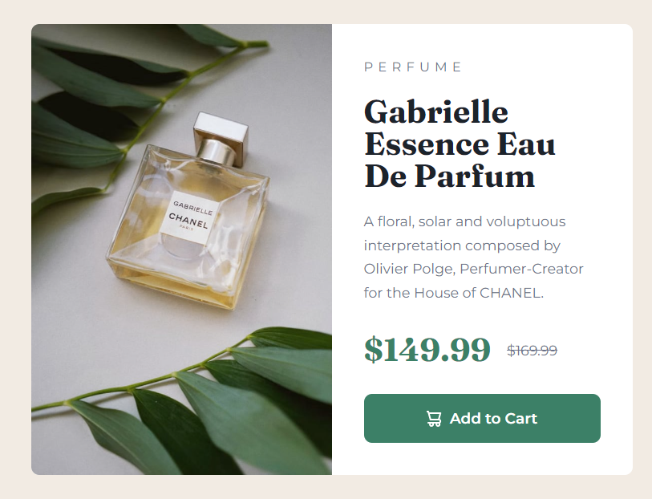

# Frontend Mentor - Product preview card component solution

This is a solution to the [Product preview card component challenge on Frontend Mentor](https://www.frontendmentor.io/challenges/product-preview-card-component-GO7UmttRfa). Frontend Mentor challenges help you improve your coding skills by building realistic projects. 

## Overview

### The challenge

Users should be able to:

- View the optimal layout depending on their device's screen size
- See hover and focus states for interactive elements

### Screenshot

 

- Live Site URL: [Add live site URL here](https://your-live-site-url.com)

### Built with

- Semantic HTML5 markup
- CSS custom properties
- Flexbox
- CSS Grid

**Note: These are just examples. Delete this note and replace the list above with your own choices**

### What I learned

1. HTML semantic tags usage.
2. CSS Flexbox properties.
3. .root{ custom rules of css}
4. Grid usage.
5. Using CSS Presets as boilerplate.
6. Using google fonts api

## Author

- Frontend Mentor - [@saketbyte](https://www.frontendmentor.io/profile/yourusername)
- Twitter - [@saketbyte](https://www.twitter.com/yourusername)

**Note: Delete this note and add/remove/edit lines above based on what links you'd like to share.**

## Acknowledgments

This is where you can give a hat tip to anyone who helped you out on this project. Perhaps you worked in a team or got some inspiration from someone else's solution. This is the perfect place to give them some credit.

I took great help from Kevin Powell's youtube channe as this was my very first challenge and I was clueless where to start.

His videos helped me give structure on approaching these challenges.